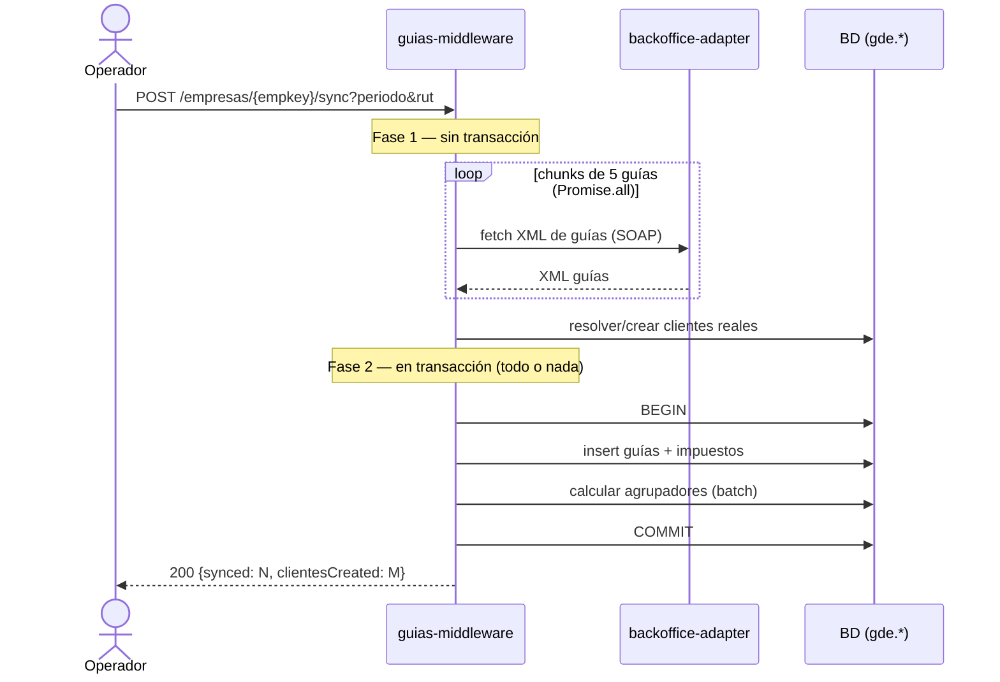
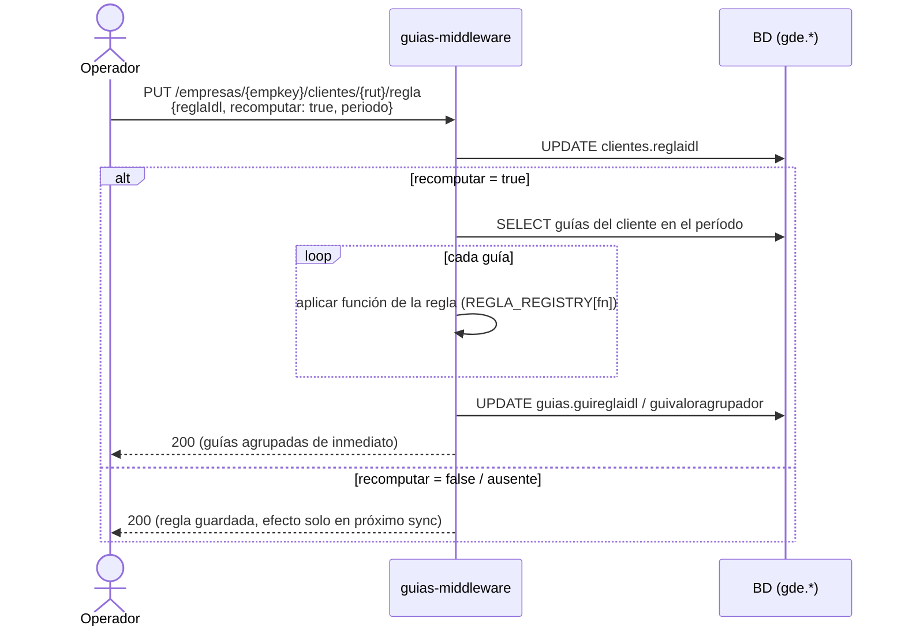
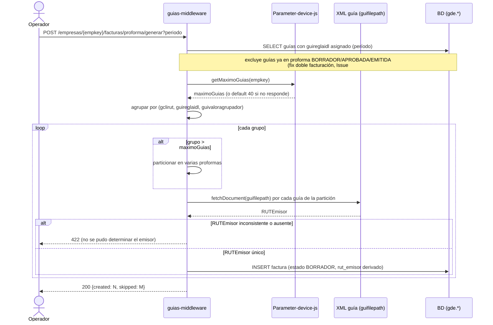
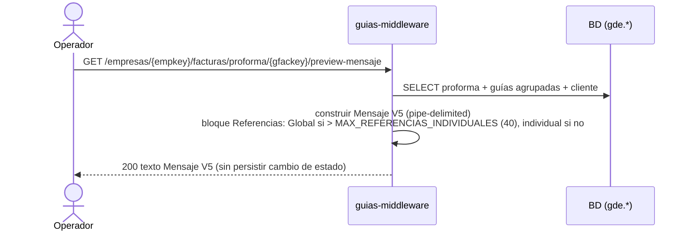
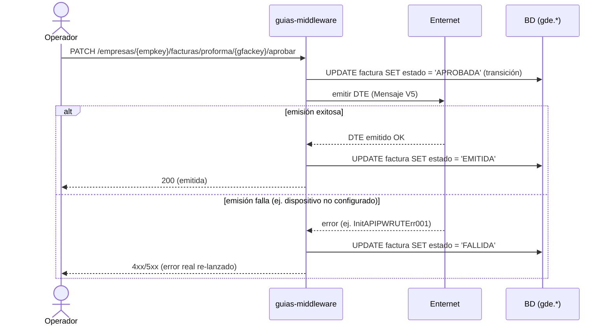
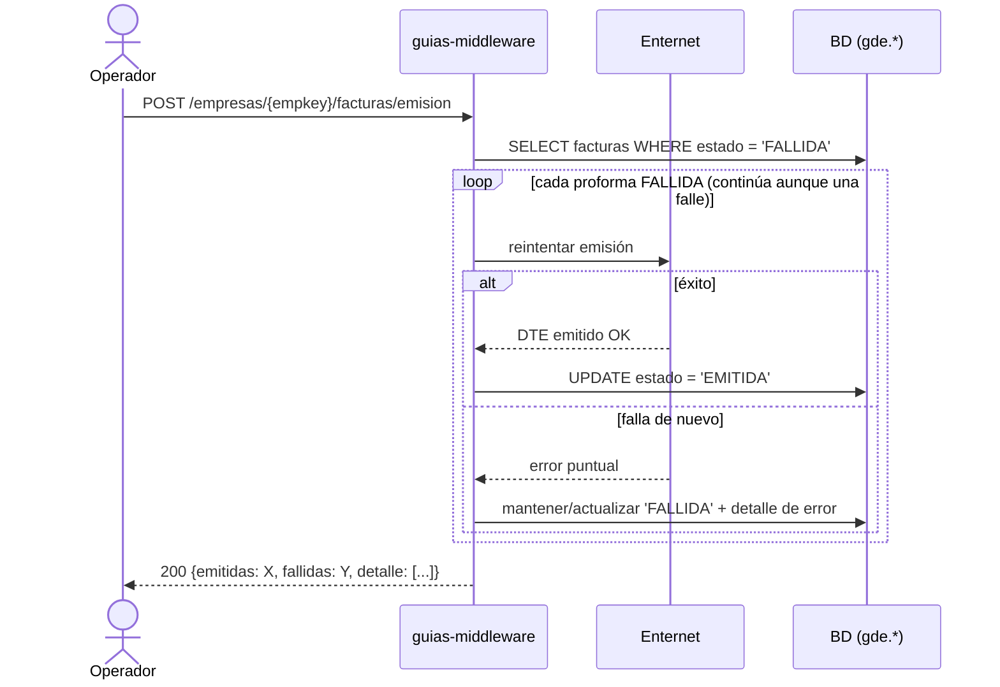

# Casos de uso y diagramas de secuencia — guías-middleware

Complemento al guion de demo en vivo (`docs/demo-dev-senior-2026-07-17.md`). Mismos 6 flujos, en formato de casos de uso + diagrama de secuencia, para quien necesita la vista conceptual sin correr curl en vivo.

**Actores**:
- **Operador**: persona/proceso que dispara las llamadas HTTP (equivalente al usuario de negocio o a un job automatizado).
- **guias-middleware**: este backend (`:3334`).
- **backoffice-adapter**: adaptador legado SOAP/GeneXus (`:3333`).
- **Parameter-device-js**: sidecar de parámetros GeneXus (`:3002`).
- **Enternet**: servicio externo de emisión DTE real.
- **BD (`gde.*`)**: PostgreSQL, schema `gde`.

---

## CU-1 — Sincronizar guías del período desde el legado

**Actor principal**: Operador.
**Precondición**: credencial (`rut`) con password configurado en `backoffice-adapter` para el `empkey` del tenant.
**Objetivo**: traer al middleware las guías de despacho visibles con esa credencial para un período dado, y dar de alta los clientes reales que aparezcan.
**Resultado**: guías insertadas en `gde.guia` (+ impuestos), clientes creados/actualizados en `gde.clientes`. Respuesta `{"synced": N, "clientesCreated": M}`.

**Flujo principal**:
1. Operador dispara el sync para un `empkey` + `periodo` + `rut` (credencial SOAP).
2. Fase 1 (sin transacción): el middleware pide al legado los XML de guías en chunks de 5 en paralelo, y resuelve/crea los clientes que aparecen en las guías.
3. Fase 2 (en transacción): inserta guías + impuestos, calcula agrupadores en batch. Todo o nada.
4. Devuelve el conteo de guías sincronizadas y clientes creados.

**Nota de diseño**: el fetch de XML (I/O de red lento) queda deliberadamente fuera de la transacción para no bloquear filas de `clientes` mientras se espera al legado.

---

## CU-2 — Asignar regla de agrupación a un cliente

**Actor principal**: Operador.
**Precondición**: cliente existente (creado por CU-1), sin regla o con regla a cambiar.
**Objetivo**: asociar una regla de agrupación (`por_comuna`, `por_razon_social`, `por_ciudad`, `por_direccion`, ...) a un cliente, y opcionalmente recalcular de inmediato las guías ya sincronizadas.
**Resultado**: `clientes.reglaidl` actualizado; si se pide `recomputar`, además `guias.guireglaidl` / `guivaloragrupador` quedan calculados para el período indicado.

**Flujo principal (con recompute)**:
1. Operador hace `PUT` de la regla para un cliente, con `reglaIdl`, `recomputar: true` y `periodo`.
2. El middleware actualiza `clientes.reglaidl`.
3. Como `recomputar` es `true`, dispara `_recomputarGuiasClientePorPeriodo`: recorre las guías del cliente en ese período y aplica la función de la regla (vía `REGLA_REGISTRY`, dispatch por el campo `fn`) para asignar `guireglaidl` / `guivaloragrupador`.
4. Guías quedan agrupables de inmediato (`GET guias/agrupadas` ya no da `[]`).

**Flujo alternativo (sin recompute)**: si no se manda `recomputar: true` + `periodo`, el `PUT` solo deja la regla guardada para el **próximo** sync — las guías ya insertadas quedan sin agrupador hasta que corra un sync nuevo.

---

## CU-3 — Generar proformas agrupadas por reglas

**Actor principal**: Operador.
**Precondición**: existen guías con `guireglaidl` ya asignado (CU-2) en el período.
**Objetivo**: agrupar todas las guías disponibles del período en proformas, una por cada combinación `(gclirut, guireglaidl, guivaloragrupador)`.
**Resultado**: N proformas en estado `BORRADOR` en `gde.factura`. Respuesta `{"created": N, "skipped": M}`.

**Flujo principal**:
1. Operador dispara la generación para un `empkey` + `periodo` (no filtra clientes).
2. El middleware toma todas las guías del período con `guireglaidl` asignado, sin importar el cliente, **excluyendo las que ya estén atadas a una proforma en `BORRADOR`/`APROBADA`/`EMITIDA`** (guardrail anti-doble-facturación, fix del Issue #48).
3. Agrupa por `(gclirut, guireglaidl, guivaloragrupador)`: cada combinación distinta (OC/HES/comuna, etc.) es una proforma propia.
4. Si un grupo excede `maximoGuias` (parámetro resuelto vía Parameter-device-js, default 40), lo particiona en varias proformas (cada partición es su propia unidad de emisor, ver punto 5).
5. Por cada partición, el `rutEmisor` se deriva del propio XML de las guías (`<Encabezado><Emisor><RUTEmisor>` en `guifilepath`) — **no** es un input del operador, porque no es fijo por empresa/cliente. Si las guías de una misma partición tienen `RUTEmisor` distinto entre sí (o alguna no lo trae), se aborta esa partición con `422` en vez de adivinar.
6. Inserta las proformas en `BORRADOR`.

---

## CU-4 — Previsualizar el Mensaje V5 sin comprometerse

**Actor principal**: Operador.
**Precondición**: proforma en `BORRADOR` (`gfackey` obtenido de CU-3, vía consulta a `gde.factura`).
**Objetivo**: ver el Mensaje V5 (formato pipe-delimited) que se enviaría a Enternet, sin emitir nada todavía.
**Resultado**: texto del mensaje devuelto en la respuesta; ningún estado cambia.

---

## CU-5 — Aprobar y emitir una proforma

**Actor principal**: Operador.
**Precondición**: proforma en `BORRADOR`.
**Objetivo**: aprobar la proforma y emitirla contra Enternet en el mismo llamado.
**Resultado (camino feliz)**: proforma pasa a `EMITIDA`.
**Resultado (camino de fallo)**: si `_emitir()` falla (ej. empresa no configurada para operar en el dispositivo), la proforma cae a `FALLIDA` y el error se re-lanza como 4xx/5xx real al caller HTTP.

---

## CU-6 — Reintentar emisión de proformas fallidas en batch

**Actor principal**: Operador.
**Precondición**: existen proformas en estado `FALLIDA` para el `empkey` (dejadas por CU-5).
**Objetivo**: reintentar la emisión de todas las `FALLIDA` de la empresa, sin abortar en el primer error.
**Resultado**: cada proforma pasa a `EMITIDA` o se mantiene/actualiza como `FALLIDA` con su error puntual. Respuesta con detalle por proforma.

---

## Nota de origen

Estos casos de uso y diagramas son una re-expresión conceptual de los flujos ya probados en vivo el 2026-07-17 (ver checklist en `docs/demo-dev-senior-2026-07-17.md`). No agregan comportamiento nuevo — documentan el mismo contrato observado en esa corrida real.
