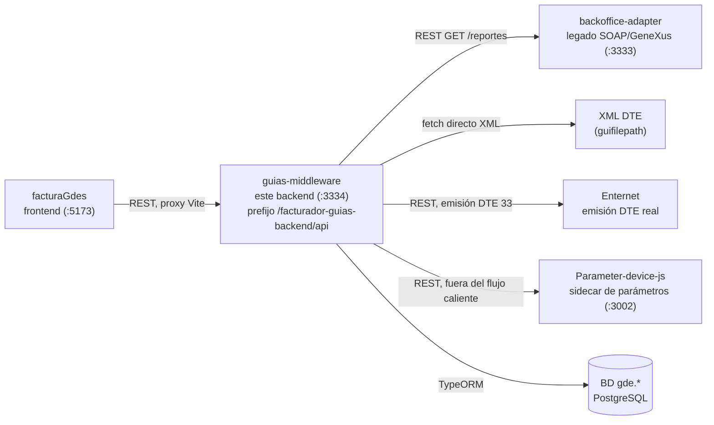

# Mapa de arquitectura de sistemas — guías-middleware

Punto de entrada antes de leer los diagramas de secuencia por caso de uso (`docs/casos-de-uso-diagramas-secuencia-2026-07-17.md`). Este doc no narra ningún flujo temporal — solo ubica qué sistema le habla a cuál, por qué protocolo y en qué puerto, para tener el mapa completo antes de entrar al detalle de cada CU.

## Sistemas

| Sistema | Puerto | Protocolo | Responsabilidad |
|---|---|---|---|
| **facturaGdes** | `:5173` | REST vía proxy Vite | Frontend — es el actor real detrás de "Operador" en el uso actual del sistema; dispara las llamadas HTTP hacia guias-middleware. |
| **guias-middleware** | `:3334` (prefijo `/facturador-guias-backend/api`) | REST | Este backend — motor de reglas de agrupación de guías en proformas y puente hacia la emisión DTE. |
| **backoffice-adapter** | `:3333` | REST (abstrae SOAP legado) | Adaptador legado SOAP/GeneXus — nunca se habla SOAP directo, todo pasa por su fachada REST. |
| **XML DTE (`guifilepath`)** | — | fetch directo | XML del documento tributario de cada guía — se descarga directo, no vía backoffice-adapter. |
| **Parameter-device-js** | `:3002` | REST | Sidecar de parámetros GeneXus, consultado fuera del flujo caliente (ej. `maximoGuias`). |
| **Enternet** | — | REST | Servicio externo de emisión DTE real (destino final de la Factura Proforma aprobada). |
| **BD (`gde.*`)** | — | TypeORM | PostgreSQL, schema `gde` — persistencia de guías, clientes, reglas y facturas proforma. |

## Nota de origen

Re-expresión conceptual de la arquitectura ya documentada como diagrama ASCII en `docs/demo-dev-senior-2026-07-17.md:11-25`, formalizada acá como diagrama Mermaid para servir de referencia durable (no atada a un guion de demo puntual). Sin comportamiento nuevo — mismos sistemas, mismos puertos, mismos protocolos ya validados en esa demo en vivo del 2026-07-17.
